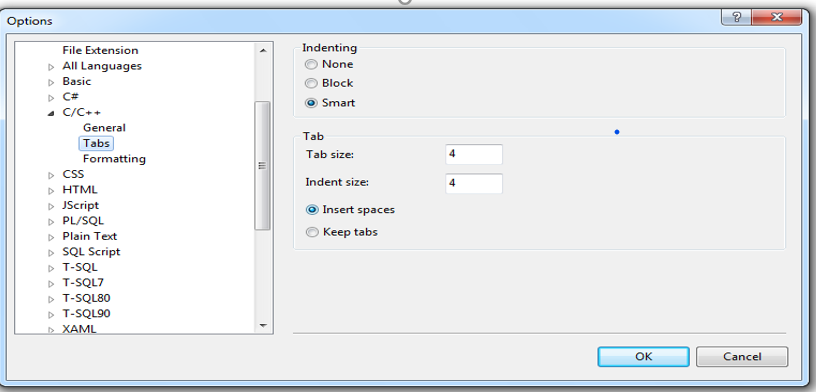

#  Programming Coding Standards

**Guide**


 Draft July 2019

Intellectual Property of DevTeam


            www.cdevteam.com

# Table of Contents
[[toc]]

#  Introduction

## Goals

The intent of this document is not to codify current practice at DevTeam as it stands at the time of writing. Instead, this guide has the following aims:

- To maximize readability and maintainability by prescribing a unified style.
- To maximize efficiency with logical, easy-to-understand and justifiable rules that balance code safety with ease-of-use.
- To maximize the usefulness of code-completion tools and accommodate IDE- or framework generated code.
- To prevent errors and bugs (especially hard-to-find ones) by minimizing complexity and applying proven design principles.
- To improve performance and reliability with a list of best practices.

Wherever possible, however, the guidelines include a specific justification for each design choice.

Unjustified guidelines must be either _justified_ or _removed_.

## Scope

This handbook mixes recommendations for programming with c, .NET, MVC, AngularJS and the AFCG libraries. It includes rules for document layout (like whitespace and element placement) as well as design guidelines for elements and best practices for their use. It also assumes that you are using Microsoft Visual Studio 2017 or newer.

This guide is a work-in-progress and covers only those issues that DevTeam has encountered and codifies only that which DevTeam has put into practice and with which DevTeam has experience.

Therefore, some elements of style and design as well as some implicit best practices are probably not yet documented. _Speak up_ if you think there is something missing.

## Fixing Problems in the Guide

Unless otherwise noted, these guidelines **are not**** optional **, nor are they up to** interpretation**.

- If a guideline is not sufficiently clear, recommend a clearer formulation.
- If you don&#39;t like a guideline, try to get it changed or removed, but **don&#39;t just ignore** it.

## Fixing Problems in Code

If code is non-conforming, it should be fixed at the earliest opportunity.

- If the error is small and localized, you should fix it with the next check-in (noting during the code review that the change was purely stylistic and unrelated to other bug fixes).
- If the error is larger and/or involves renaming or moving files, you should check the change in separately in order to avoid confusion.
- If the problem takes too long to repair quickly, you should create an issue in the Team Foundation Server to address the problem at a later time.

#  When Does this Guide Apply

It is the intention that all code written for or by DevTeam adheres to this standard. However, there are some cases where it is impractical or impossible to apply these conventions.

This document applies to all code except the following:

## Code changes made to existing systems not written to this standard

In general, it is a good idea to make your changes conform to the surrounding code style wherever possible. You should choose to adopt this standard for major additions to existing systems or when you are adding code that you think will become part of the DevTeam code library.

## Code written for customers that require that their standards should be adopted

DevTeam may, from time to time work with customers that have their own coding standards. Most coding standards applicable to a Microsoft development language derive at least some of their content from a Microsoft white paper that documented a set of suggested naming standards. For this reason, many coding standards are broadly compatible with each other. This document goes a little further than most in some areas; however, it is likely that these extensions will not conflict with most other coding standards. We must be absolutely clear on this point: if there is a conflict, the customer&#39;s coding standards are to apply - always.

# Naming Guidelines

Of all the components that make up a coding standard, naming standards are the most visible and arguably the most important.

Having a consistent standard for naming the various objects in your program will save you an enormous amount of time both during the development process itself and also during any later maintenance work.

## Overview

For those of you coding in VB.NET, first things first, always use Option Explicit. The reasons are so obvious that I won&#39;t discuss it any further.

Remove the Visual Basic reference from your project. Making use of the original Visual Basic functions has been proven to be up to 1000 times slower than the .NET counterparts; you have been warned.

## General Rules

- Names are in US-English (e.g. use &quot;color&quot; instead of &quot;colour&quot;).
- Names conform to English grammatical conventions (e.g. use ImportableDatabase instead of DatabaseImportable).
- Names should be as short as possible without losing meaning.
- Prefer whole words or stick to predefined short forms or abbreviations of words.
- Make sure to capitalize compound words correctly; if the word is not hyphenated, then it does not need a capital letter in the camel- or Pascal-cased form. For example, &quot;metadata&quot; is written as Metadata in Pascal-case, not MetaData.
- Acronyms should be Pascal-case as well (e.g. &quot;Xml&quot; or &quot;Sql&quot;) unless they are only two letters long. Acronyms at the beginning of a camel-case identifier are always all lowercase (more info see Abbreviations).
- Identifiers differing only by case may be defined within the same scope only if they identify different language elements (e.g. a local variable and a property).
```csharp
public void UpdateLength(int newLength, bool refreshViews)

{

int length = Length;

// ...

}
```
- You may not use identifiers that are keywords in c; neither may you use the @-symbol to turn a keyword into a valid identifier.

## Capitalization Styles

Use the following three conventions for capitalizing identifiers.

### Pascal Case

The first letter in the identifier and the first letter of each subsequent concatenated word are capitalized. You can use Pascal case for identifiers of three or more characters. For example:

**B** ack **C** olor

### Camel Case

The first letter of an identifier is lowercase and the first letter of each subsequent concatenated word is capitalized. For example:

**b** ack **C** olor

### Upper Case

All letters in the identifier are capitalized. Use this convention only for identifiers that consist of two or fewer letters. For example:
```csharp
System.IO

System.Web.IO
```
You might also have to capitalize identifiers to maintain compatibility with existing, unmanaged symbol schemes, where all uppercase characters are often used for enumerations and constant values. In general, these symbols should not be visible outside of the assembly that uses them.

The following table summarizes the capitalization rules and provides examples for the different types of identifiers:


| **Identifier** | **Case** | **Example** |
| --- | --- | --- |
| Class | Pascal | AppDomain |
| Enum type | Pascal | ErrorLevel |
| Enum values | Pascal | FatalError |
| Event | Pascal | ValueChange |
| Exception class | Pascal | WebException Note: Always ends with the suffix Exception. |
| Read-only Static field | Pascal | RedValue |
| Interface | Pascal | IDisposable Note: Interfaces always begin with the prefix I. |
| Method | Pascal | ToString |
| Namespace | Pascal | System.Drawing |
| Parameter | Camel | typeName |
| Property | Pascal | BackColor |
| Private instance field | &quot;\_&quot; + Camel | \_redValueThe underscore breaks ambiguity between a private instance field and its public access property in internal class code. |
| Protected instance field | Camel | redValue Note: Rarely used. A property is preferable to using a protected instance field. |
| Public instance field | Pascal | RedValue Note: Rarely used. A property is preferable to using a public instance field. |
| Css Class | Camel | redBorderColorNote: May not apply when overwriting third-party css styles |

## Case Sensitivity (not applicable to VB)

To avoid confusion and guarantee cross-language interoperation, follow these rules regarding the use of case sensitivity:

1. Do not use names that require case sensitivity. Components must be fully usable from both case-sensitive and case-insensitive languages. Case-insensitive languages cannot distinguish between two names within the same context that differ only by case. Therefore, you must avoid this situation in the components or classes that you create.
2. Do not create two namespaces with names that differ only by case. For example, a case insensitive language cannot distinguish between the following two namespace declarations.
```csharp
namespace MyLibrary{}

namespace Mylibrary{}
```
1. Do not create a function with parameter names that differ only by case. The following example is incorrect.

void MyFunction(string a, string A);

1. Do not create a namespace with type names that differ only by case. In the following example, Point p and POINT p are inappropriate type names because they differ only by case.
```csharp
System.Windows.Forms.Point p;

System.Windows.Forms.POINT p;
```
1. Do not create a type with property names that differ only by case. In the following example, int Color and int COLOR are inappropriate property names because they differ only by case.
```csharp
int Color {get; set;}

int COLOR {get; set;}
```
1. Do not create a type with method names that differ only by case. In the following example, calculate and Calculate are inappropriate method names because they differ only by case
```csharp
void calculate();

void Calculate();
```
## Abbreviations

To avoid confusion and guarantee cross-language interoperation, follow these rules regarding the use of abbreviations:

1. Do not use abbreviations or contractions as parts of identifier names. For example, use GetWindow instead of GetWin.
2. Where appropriate, use well-known acronyms to replace lengthy phrase names. For example, use UI for User Interface and OLAP for On-Line Analytical Processing.
3. Do not use acronyms that are not generally accepted in the computing field. (For example, XML, TTL, DNS, UI, IP and IO are all OK.)
4. When using acronyms, use Pascal case or camel case for acronyms more than two characters long. For example, use htmlButton or HTMLButton. However, you should capitalize acronyms that consist of only two characters, such as System.IO instead of System.Io.
5. Do not use abbreviations in identifiers or parameter names. If you must use abbreviations, use Camel Case for abbreviations that consist of more than two characters, even if this contradicts the standard abbreviation of the word.

## Namespaces

### Usage

- **Do not** use the global namespace; the only **exception** is for ASP.NET pages that are generated into the global namespace.
- Avoid fully-qualified type names; use the using statement instead.
- If the IDE inserts a fully-qualified type name in your code, you should fix it. If the unadorned name conflicts with other already-included namespaces, make an alias for the class with a using clause.
- **Avoid** putting a using statement inside a namespace (unless you must do so to resolve a conflict).
- **Avoid** deep namespace-hierarchies (five or more levels) as that makes it difficult to browse and understand.
- **Do not** reference unnecessary libraries, include unnecessary header files, or reference unnecessary assemblies. Paying attention to small things like this can improve build times, minimize chances for mistakes, and give readers a good impression

### Naming

- **Never** declare more than 1 namespace per file.
- **Avoid** making too many namespaces; instead, use catch-all namespace suffixes, like &quot;Utilities&quot;, &quot;Core&quot; or &quot;General&quot; until it is clearer whether a class or group of classes warrant their own namespace. Refactoring is your friend here.
- **Do not** include the version number in a namespace name.
- Use long-lived identifiers in a namespace name.
- Namespaces should be plural, as they will contain multiple types (e.g. DevTeam.Expressions instead of DevTeam.Expression).
- If your framework or application encompasses more than one tier, use the same namespace identifiers for similar tasks. For example, common data-access code goes in DevTeam.Data.
- **Avoid** using &quot;reserved&quot; namespace names like System because these will conflict with standard .NET namespaces and require resolution using the
global::namespace prefix.

### Standard Prefixes

- Namespaces at DevTeam start with DevTeam
- Namespaces for DevTeam products start with DevTeam.\&lt;ProductName\&gt;

Example: DevTeam.Enteract

- Namespaces for customer products start with \&lt;CustomerName\&gt;.\&lt;ProductName\&gt;

Acronyms should be used for customer names that are too long, in most cases the customer already have the acronym for them. Example:

Customer Department of Education (DE)

DevTeam.DE.PIE

### Grouping and ordering

        The namespaces at the top of the file should be in the following order:

| System.\* | .NET framework libraries |
| --- | --- |
| Third party | Non-DevTeam third party libraries |
| DevTeam.\* | Organize in order of dependency |

# Formatting

The formatting rules were designed for use with c. Where possible, they should be applied to other languages (CSS, JavaScript, etc.) as well.

## Indent and spacing

-
An indent is four (4) spaces; it is never a tab.
 
- Use a single space after a comma (e.g. between function arguments).
- There is no space after the leading parenthesis/bracket or before the closing parenthesis/bracket.
- There is no space between a method name and the leading parenthesis, but there is a space before the leading parenthesis of a flow control statement.
- Use a single space to surround all 2 infix operators (e.g. firstValue ?? secondvalue : thirdValue); there is no space between a prefix operator (e.g. &quot;-&quot; or &quot;!&quot;) and its argument.
- Do not use spacing to align type members on the same column (e.g. as with the members of an enumerated type).

## Braces

- Curly braces should—with a few exceptions outlined below—go on their own line.
- A line with only a closing brace should never be preceded by an empty line.
- A line with only an opening brace should never be followed by an empty line.

## Properties

Complex getters and setters should have each bracket on its own line. The only exception to this rule is for getters and setters consisting of only a single expression.
```csharp
public string ObjectId
  {
      get { return (string)ViewState["ObjectId"]; }
      set { ViewState["ObjectId"] = value; }
 }
 ```

## Enumerations

- Use the trailing comma for the last member of an enumeration; this makes it easier to move them around, if needed.

## Return Statements

- If a return statement is not the only statement in a method, it should be separated from other code by a single newline (or a line with only a bracket on it).
```csharp
if (a == 1)
{
  return true;
}

return false;
```
- **Do not** use else with return statements (use the style shown above instead):

if (a == 1)

{

  return true;

}

else// Not necessary

{

  return false;

}

## Switch Statements

- Contents under switch statements should be indented.
- Braces for a case-label are not indented; this maintains a nice alignment with the brackets from the switch-statement.
- Use braces for longer code blocks under case-labels; leave a blank line above the break statement to improve clarity.

switch (flavor)

{

  case Flavor.Up:

  case Flavor.Down:

  {

    if (someConditionHolds)

    {

      // Do some work

    }

    // Do some more work

    break;

  }

  default:

    break;

}

## Parentheses

- c has a different operator precedence than Pascal or C, so you can write context != null &amp;&amp; context.Count \&gt; 0 without confusing the compiler. However, you should use the form (context != null) &amp;&amp; (context.Count \&gt; 0) for legibility&#39;s sake.
- **Do not** use parentheses around the parameter(s) in a lambda expression accepting a single parameter.
- To make it more readable, use parentheses around the condition of a ternary expression if it uses an infix operator.

return (Value != null) ? Value.ToString() : &quot;NULL&quot;;

- Prefix operators (e.g. &quot;!&quot;) and method calls should not have parentheses around them.

return !HasValue ? Value.ToString() : &quot;EMPTY&quot;;

## Empty Lines

In the following list, the phrase &quot;surrounding code&quot; refers to a line consisting of more than just an opening or closing brace. That is, no new line is required when an element is at the beginning or end of a methods or other block-level element.

Always place an empty line in the following places:

- Between the file header and the namespace declaration or the first using statement.
- Between the last using statement and the namespace declaration.
- Between types (classes, structs, interfaces, delegates or enums).
- Between public, protected and internal members.
- Between a call to a base method and ensuing code.
- Between return statements and surrounding code (this does not apply to return statements at the beginning or end of methods).
- Between block constructs (e.g. while loops or switch statements) and surrounding code.
- Between documented enum values; undocumented may be grouped together.
- Between logical groups of code in a method; this notion is subjective and more a matter of style. You should use empty lines to improve readability, but should not overuse them.
- Between the last line of code in a block and a comment for the next block of code.
- Between statements that are broken up into multiple lines.
- Between a #region tag and the first line of code in that region.
- Between the last line of code in a region and the #endregion tag.

**Do not** place an empty line in the following places:

- After another empty line; the AFCG style uses only single empty lines.
- Between retrieval code and handling for that code. Instead, they should be formatted together.

IMetaReadableObject obj = context.Find\&lt;IMetaReadableObject\&gt;();

if (obj == null)

{

context.Recorder.Log(Level.Fatal, String.Format(&quot;Error!&quot;));

return null;

}

- Between any line and a line that has only an opening or closing brace on it (i.e. there should be no leading or trailing newlines in a block).
- Between undocumented fields (usually private); if there are many such fields, you may use empty lines to group them by purpose.

## Line Breaking

- **Do not** put more than one statement on a single line because it makes stepping through the code in a debugger much more difficult.

         Good:

// C++ / c sample:

a = 1;

b = 2;

&#39; VB.NET sample:

If (IsAdministrator()) Then

    Console.WriteLine(&quot;YES&quot;)

EndIf

Bad:

// C++ / c sample:

a = 1; b = 2;

&#39; VB.NET sample:

If (IsAdministrator()) Then Console.WriteLine(&quot;YES&quot;)

- No line should exceed 100 characters; use the line-breaking rules listed below to break up a line.
- Use line-breaking only when necessary; do not adopt it as standard practice.
- If one or more line-breaks is required, use as few as possible.
- Line-breaking should occur at natural boundaries; the most common such boundary is between parameters in a method call or definition.
- Lines after such a line-break at such a boundary should be indented.
- The separator (e.g. a comma) between elements formatted onto multiple lines goes on the same line after the element; the IDE is much more helpful when formatting that way.
- The most natural line-breaking boundary is often before and after a list of elements. For example, the following method call has line-breaks at the beginning and end of the parameter list.

people.DataSource = CurrentCompany.Employees.GetList(

connection, metaClass, GetFilter(), null

);

- If one of the parameters is much longer, then you add line-breaking between the parameters; in that case, all parameters are formatted onto their own lines:

people.DataSource = CurrentCompany.Employees.GetList(

connection,

metaClass,

GetFilter(&quot;Global.Applications.Updater.PersonList.Search&quot;),

null

);

- Note in the examples above that the parameters are indented. If the assignment or method call was longer, they would no longer fit on the same line. In that case, you should use two levels of indenting.

Application.Model.people.DataSource =

          Global.ApplicationEnvironment.CurrentCompany.Employees.GetList(

connection,

metaClass,

GetFilter(&quot;Global.Applications.Updater.PersonList.Search&quot;),

null

  );

- Avoid nesting more than two ternary operators in a single line. Break it down into a series of if/else statements.

// Bad!

bool result = condition1 ? true : contition2 ? true : condition3 ? true : false;

// Good!

if(condition1)

       {

           result = true;

       }

       elseif(condition2)

       {

           result = true;

       }

       elseif(condition3)

       {

           result = true;

       }

       else

       {

           result = false;

}

## Table of Standard Control Prefixes

The following table is a list of the common types of controls you will encounter together with their prefixes:

| **Prefix** | **Control** |
| --- | --- |
| btn | Button |
| cb | CheckBox |
| cbl | CheckBoxList |
| ddl | DropDownList |
| fu | FileUpload |
| hf | HiddenField |
| hl | HyperLink |
| img | Image |
| ibtn | ImageButton |
| lbl | Label |
| lbtn | LinkButton |
| lb | ListBox |
| lit | Literal |
| mvw | MultiView |
| pnl | Panel |
| ph | PlaceHolder |
| rb | RadioButton |
| rbl | RadioButtonList |
| txt | TextBox |
| vw | View |
| wzd | Wizard |
| lvw | ListView |
| gvw | GridView |
| fvw | FormView |
| rpt | Repeater |
| ods | ObjectDataSource |
| valreq | RequiredFieldValidator |
| valrng | RangeValidator |
| valcom | CompareValidator |
| valrex | RegularExpressionValidator |
| valcus | CustomValidator |
| valsum | ValidationSummary |
| sm | ScriptManager |
| udp | UpdatePanel |
| up | UpdateProgress |

## Code Commenting

- All comments should be written in the same language, be grammatically correct, and contain appropriate punctuation.
-  Use // or /// but never /\* … \*/
-   **Do not**&quot;flowerbox&quot; comment blocks.

// \*\*\*\*\*\*\*\*\*\*\*\*\*\*\*\*\*\*\*\*\*\*\*\*\*\*\*\*\*\*\*\*\*\*\*\*\*\*\*

// Comment block

// \*\*\*\*\*\*\*\*\*\*\*\*\*\*\*\*\*\*\*\*\*\*\*\*\*\*\*\*\*\*\*\*\*\*\*\*\*\*\*

- Use inline-comments to explain assumptions, known issues, and algorithm insights.
- In-line comments are the Post-It notes of programming. This is where you make annotations to help yourself or another programmer who needs to work with the code later. Use In-line comments to make notes in your code about:
  - _What you are doing._
  - _Where you are up to._
  - _Why you have chosen a particular option._
  - _Any external factors that need to be known._
- Here are some examples of appropriate uses of In-line comments:
- What we are doing:

// Now update the control totals file to keep everything in sync

- Where we are up to:

// At this point, everything has been validated.

// If anything was invalid, we would have exited the procedure.

- Why we chose a particular option:

// Use a sequential search for now because it&#39;s simple to code

// We can replace with a binary search later if it&#39;s not fast

// enough

// We are using a file-based approach rather than doing it all

// in memory because testing showed that the latter approach

// used too many resources under Win2000. That&#39;s why the code

// is here rather than in XXX.VB where it belongs.

- External factors that need to be kept in mind:

// This assumes that the INI file settings have been checked by

// the calling routine

- **Do not** use inline-comments to explain obvious code. Well written code is self-documenting.
- Notice that we are **not** documenting what is self-evident from the code. Here are some examples of **inappropriate** In-line comments:

// Declare local variables

int currentEmployee;

// Increment the array index

currentEmployee += 1;

// Call the update routine

UpdateRecord();

- Include comments using Task-List keyword flags to allow comment-filtering.

// TODO: Place Database Code Here

// TODO: Removed P\Invoke Call due to errors

- Always apply c comment-blocks (///) to public, protected, and internal
- Only use c comment-blocks for documenting the API.
- Always include \&lt;summary\&gt; Include \&lt;param\&gt;, \&lt;return\&gt;, and  \&lt;exception\&gt;comment sections where applicable.
- Include \&lt;see cref=&quot;&quot;/\&gt;and \&lt;seeAlso cref=&quot;&quot;/\&gt;where possible.
- Always add **CDATA** tags to comments containing code and other embedded markup in order to avoid encoding issues.
- **Example:**

/// \&lt;example\&gt;

/// Add the following key to the &quot;appSettings&quot; section of your config:

/// \&lt;code\&gt;\&lt;![CDATA[

///         \&lt;configuration\&gt;

///                 \&lt;appSettings\&gt;

///                         \&lt;add key=&quot;mySetting&quot; value=&quot;myValue&quot;/\&gt;

///                 \&lt;/appSettings\&gt;

///         \&lt;/configuration\&gt;

/// ]]\&gt;\&lt;/code\&gt;

/// \&lt;/example\&gt;

- Comments example of a class:
 /// \&lt;summary\&gt;

    /// Applications workflow item object class.

    /// \&lt;/summary\&gt;

    /// \&lt;author\&gt;

    /// A.G. Rosario

    /// \&lt;/author\&gt;

    /// \&lt;remarks\&gt;

    /// Provide the functionality to manage the workflow process of an a item record from the database.

    /// \&lt;/remarks\&gt;
public class WorkflowItem

    {

                …

    }

- **Do not**** leave commented code.** Every code is in a repository so it can be consulted anytime in the future.

# Language Usage

## Declaration Order

- Group internal class implementation by type in the following order:

-
  1. Nested Enums, Structs, and Classes
  2. Member variables
  3. Properties
  4. Constructors &amp; Finalizers
  5. Methods

- Sequence declarations within type groups based upon access modifier and visibility:

-
  1. Public
  2. Protected
  3. Internal
  4. Private

- Segregate interface Implementation by using **#region** statements

## Visibility

- The visibility modifier is required for all types, methods and fields; this makes the intention explicit and consistent.
- The visibility keyword is always the first modifier.
- The **const** or **readonly** keyword, if present, comes immediately after the visibility modifier.
- The **static** keyword, if present, comes after the visibility modifier and **readonly** modifier.

**private readonly static string**** DefaultDatabaseName** = &quot;admin&quot;;

## Constants

- Declare all constants other than **0** , **1** , **true** , **false** and **null**.
- Use **true** and **false** only for assignment, never for comparison.
- Avoid passing **true** or **false** for parameters; use an **enum** or constants to impart meaning instead.
- If there is a logical connection between two constants, indicate this by making the initialization of one dependent on the other.

**public const int** DefaultCacheSize = 25;

**public const int** DefaultGranularity = DefaultCacheSize / 5;

## Readonly vs Const

- The difference between **const** and **readonly** is that **const** is compiled and **readonly** is initialized at runtime.
- Use **const** only when the value really is constant (e.g. **NumberDaysInWeek** ); otherwise, use **readonly**.
- Though **readonly** for references only prevents writing of the reference, not the attached value, it is still a helpful hint for both the compiler and the reader.

## String and Resources

- **Do not** hardcode strings that will be presented to the user; use resources instead. For products in development, this text extraction can be performed after the code has crystallized somewhat.
- Resource identifiers should be alphanumeric, but may also include a dot (&quot;.&quot;) to logically nest resources. It should contain the name of the control sample &quot;lblName&quot;, &quot;lblLastName&quot;, etc.
- **Do not** use constants for strings; use resource tables instead (this aids translation, if necessary).
- Configuration data should be moved into application settings as soon as possible.

## Properties

- Prefer automatic properties as it saves a lot of typing and vastly improves readability.

**public**** bool **ShowTab{** get **;** set**;}

- If there a exceptional need to manage the internal value of public property then you can create private properties.
- Use read-only properties if there is no logical reason for calling code to be able to change the value.
- Properties should be commutative; that is, it should not matter in which order you set them.
- Avoid enforcing an ordering by using a method to execute code that you would want to execute from the property setter. The following example is incorrect because setting the password before setting the name causes a login failure.

**class** SecuritySystem

{

**public string** UserName {   **get**** ; **** set ****;** }

**public int** Password

{

**get** ;

**set**

{

LogIn();

}

}

**protected**** void**LogIn()

{

IPrincipal principal =

Authenticate(UserName, Password);

}

**private** IPrincipal Authenticate( **string** UserName,

**int** Password)

{

// Authenticate the user

}

}

- Instead, you should take the call LogIn() out of the setter for Password and make the method public, so the class can be used like this instead:

SecuritySystem system = new SecuritySystem();

system.Password = &quot;knockknock&quot;;

system.UserName = &quot;Encodo&quot;;

system.LogIn();

- In this case, Password can be set before the UserName without causing any problems.

## Methods / Functions

- Methods should not have more than 200 lines of code.
- Avoid returning null for methods that return collections or strings. Instead, return an empty collection (declare a static empty list) or an empty string (Empty).
- Overloads:
  - Overloads are encouraged for methods that are in the same family and either serve the same purpose or have similar behavior. Do not use the types of parameters to distinguish these functions from one another. For example, the following is incorrect

**void** Update();

**void** UpdateUsingQuery(IQuery query);

**void** UpdateUsingSql( **string** sql);

-
  - Instead, use an overload, letting the method signature describe the different functions. This reduces the perceived size of the API and makes it easier to understand.

**void** Update();

**void** Update(IQuery query);

**void** Update( **string** sql);

## Parameters

- Methods should not have more than 10 parameters (consider using a **struct** instead).
- Methods should not have more than 2 out or ref parameters (consider using a **struct** instead).
- **ref** and **out** parameters should come last in the list of parameters.
- The implementation of an interface method should use the same parameter name as that given in the interface method declaration.

- **Do not** declare reserved parameters (use overloads in future library versions instead).

## Classes

- Never declare more than one field per line; each field should be an individually documentable entity.
- **Do not** use **public** or **protected** fields; use private fields exposed through properties instead.
- **Do not** create too many static classes; instead, determine whether new functionality can be added to an existing static class.

## Interfaces

- Use interfaces to &quot;fake&quot; multiple-inheritance.
- Define interfaces if there will be more than one implementation of a hierarchy; without multiple-inheritance, this is the only way to remain flexible as to the implementation.
- Define interfaces to clearly define what comprises an API; an interface will generally be smaller and more tightly-defined that the class that implements it. A class-based hierarchy runs the risk of mixing interface methods with implementation methods.
- Consider using a c attribute instead of a marker interface (an interface with no members). This makes for a cleaner inheritance representation and indicates the use of the marker better (e.g. NUnit tests as well as the serializing subsystem for .NET use attributes instead of marker interfaces).
- Re-use interfaces as much as possible to avoid having many very similar interfaces that cause confusion as to which one should be used where.
- Keep interfaces relatively small in order to ease implementation (5-10 members).
- Where possible, provide an abstract class or default descendent that application code can use for implementing an interface. This provides both an implementation example and some protection from future changes to the interface.
- Use interfaces where the functionality isn&#39;t the direct purpose of the object or to expose a part of the class&#39;s functionality (as with aspect-oriented programming).
- Use explicit interface implementation where appropriate to avoid expanding a class API unnecessarily.
- Each interface should be used at least once in non-testing code; otherwise, get rid of it.
- Always provide at least one, tested implementation of an interface.

## Structs

Consider defining a structure instead of a class if most of the following conditions apply:

- Instances of the type are small (16 bytes or less) and commonly short-lived.
- The type is commonly embedded in other types.
- The type logically represents a single value and is similar to a primitive type, like an **int** or a **double**.
- The type is immutable.
- The type will not be boxed frequently.

Use the following rules when defining a **struct** :

- Avoid methods; at most, have only one or two methods other than overrides and operator overloads.
- Provide parameterized constructors for initialization.
- In scenarios that require a significant amount of boxing and un-boxing, value types perform poorly as compared to reference types.
- Overload operators and equality as expected; implement IEquatable instead of overriding **Equals** in order to avoid the negative performance impact of boxing and un-boxing the value.
- A **struct** should be valid when uninitialized so that consumers can declare an instance without calling a constructor.
- Public fields are allowed (even encouraged) for structures used to communicate with external APIs through unmanaged code.

## Enumerations

- Always use enumerations for strongly-typed sets of values
- Use enumerations instead of lists of static constants _unless_ that list can be extended by descendent code; if the list is not logically open-ended, use an **enum**.
- Enumerations are like interfaces; be extremely careful of changing them when they are already included in code that is not under your control (e.g. used by a framework that is, in turn, used by external application code). If the enumeration must be changed, use the **ObsoleteAttribute** to mark members that are no longer in use.
- **Do not** assign a type to an **enum** unless absolutely necessary; use the default type of **Int32** whenever possible.
- **Do not** include sentinel values, such as **FirstValue** or **LastValue**.
- **Do not** assign explicit values to simple enumerations except to enforce specific values for storage in a database.
- The first value in an enumeration is the default; make sure that the most appropriate simple enumeration value is listed first.

## Local variables

- Declare a local variable as close as possible to its first use (and within the most appropriate scope).
- If a local variable is initialized, put the initialization on the same line as the declaration. If the line gets too long, use multiple lines as described before in this guide.

## Event Handlers

You should use the pattern and support classes for event-handling provided by the .NET library.

- Do not expose delegates as public members; instead declare events using the event keyword.
- **Do not** add a method to a delegate with new **EventHandler(…)**; instead, use delegate inference.
- **Do not** define custom delegates for event handling; instead use **EventHandler\&lt;T\&gt;**.
- Put all extra event data into an **EventArgs** descendent; subsequent versions can alter this descendent without changing the signature.
- Use **CancelEventArgs** as the base class if you need to be able to cancel an event.
- Neither the sender parameter nor the **args** parameter may be null; this avoids forcing event handlers to check for null.
- **EventsArgs** descendents should declare only properties, not methods or other application logic.

## Operators

- Be extremely careful when overloading operators; in general, you should only do so for **structs**. If you feel that an operator overload is especially clever, it probably isn&#39;t; check with another developer before coding it.
- Avoid overriding the **==** operator for reference types; override the **Equals()** method instead to avoid redefining reference equality.
- If you do override **Equals()**, you should also override **GetHashCode()**.
- If you do override the **==** operator, consider overriding the other comparison operators **(!=, \&lt;, \&lt;=, \&gt;, \&gt;=)** as well.
- You should return false from the **Equals()** function if the objects cannot be compared.
- However, if they are different types, you may throw an exception.

## If Statements

- **Do not** compare to **true** or **false** ; instead, compare pure Boolean expressions.
- Initialize Boolean values with simple expressions rather than using an if-statement; always use parentheses to delineate the assigned expression.

**bool** needsUpdate = (Count \&gt; 0 &amp;&amp; Objects[0].Modified);

- Always use brackets for flow-control blocks (switch, if, while, for, etc.)
- **Do not** add useless else blocks. An &quot;if&quot; statement may stand alone and an &quot;else if&quot; statement may be the last condition.

**if** (a == b)

{

// Do something

}

**else if** (a \&gt; b)

{

// Do something else

}

// No final &quot;else&quot; required

- Do not force really complicated logic into an &quot;if&quot; statement; instead, use local variables to make the intent clearer. For example, imagine we have a lesson planner and want to find all unsaved lessons that are either unscheduled or are scheduled within a given time-frame. The following condition is too long and complicated to interpret quickly:

**if** (!lesson.Stored &amp;&amp; (((StartTime \&lt;= lesson.StartTime) &amp;&amp; (lesson.EndTime \&lt;= EndTime)) || ! lesson.Scheduled))

{

// Do something with the lesson

}

Even trying to apply the line-breaking rules results in an unreadable mess:

**if** (!lesson.Stored &amp;&amp; (((StartTime \&lt;= lesson.StartTime) &amp;&amp; (lesson.EndTime \&lt;= EndTime)) || ! lesson.Scheduled))

{

// Do something with the lesson

}

Even with this valiant effort, the intent of the ||-operator is difficult to discern. With local variables, however, the logic is much clearer:

**bool** lessonInTimeSpan = ((StartTime \&lt;= lesson.StartTime) &amp;&amp; (lesson.EndTime \&lt;= EndTime));

if (!lesson.Stored &amp;&amp; (lessonInTimeSpan || ! lesson.Scheduled))

{

// Do something with the lesson

}

## Using &quot;var&quot;

The use of var is permitted ONLY when the explicit-type is **not known** or **unavailable**. The use of var can be used **only** when you need  to:

- Use the type of ObjectQuery
- Use code that changes the type at runtime instead of compiletime. Is **VERY IMPORTANT** to comment the code with the specifications of this code.

The use of var is **only allowed** when:

- The explicit-type is **not known** (anonymous).

**Example:**

var car = new { Year = 2020, Model = &quot;Mustang GT&quot;, Manufacturer = &quot;Ford&quot; };

- Working with **LINQ queries.**

**Example:**

var query = from c in DataContext

             where c.Id = 123

             select new Car

{ Year = c.Year, Model = c.Model, Manufacturer = c.Model };

- Initializing the variable directly with an **object constructor call**.

**Example:**

var car = new Car();

- Readability needs to be improved.

// Bad

List\&lt;ThisIsMyLongCustomCarTypeObject\&gt;data =

        CarTypeObjectEngine.GetAvailableModelByManufacturerId(1);

// Good

var data = CarTypeObjectEngine.GetAvailableModelByManufacturerId(1);

**Note:** _If the developer wants to know the type inside the &quot;var&quot; just move the cursor to the variable name._

The use of var is **NOT allowed** when:

- Initializing **value types** or **string**.

**Example:**

var index = 0;

var name = &quot;John Doe&quot;;


## Flow Control

- Avoid invoking methods within a conditional expression.
- Avoid creating recursive methods. Use loops or nested loops instead.
- Avoid using foreachto iterate over immutable value-type collections. E.g. String arrays.
- Do not modify enumerated items within a foreach
- Use the **ternary** conditional operator only for trivial conditions. Avoid complex or compound ternary operations.

**Example:**

int result = isValid ? 9 : 4;

- Avoid evaluating Boolean conditions against truer false.
**Example:**

// Bad!

if (isValid == true)

{…}

// Good!

if (isValid)

{…}

- Avoid assignment within conditional statements.
**Example:**

if((i=2)==2) {…}

- Avoid compound conditional expressions – use Boolean variables to split parts into multiple manageable expressions.

**Example:**

// Bad!

if (((value \&gt; \_highScore) &amp;&amp; (value != \_highScore)) &amp;&amp; (value \&lt; \_maxScore))

{…}

// Good!

isHighScore = (value \&gt;= \_highScore);

isTiedHigh = (value == \_highScore);

isValid = (value \&lt; \_maxValue);

if ((isHighScore &amp;&amp; ! isTiedHigh) &amp;&amp; isValid)

{…}

- Avoid explicit Boolean tests in conditionals.

**Example:**

// Bad!

if(IsValid == true)

{…};

// Good!

if(IsValid)

{…}

- Only use switch/casestatements for simple operations with parallel conditional logic.
- Prefer nested if/elsever switch/casefor short conditional sequences and complex conditions.
- Prefer polymorphism over switch/caseto encapsulate and delegate complex operations.

## Exceptions

- Do not use try/catchblocks for flow-control.
- Only catchexceptions that you can handle.
- Never declare an empty catch
- Avoid nesting a try/catchwithin a catch
- Always catch the most derived exception via exception filters.
- Order exception filters from most to least derived exception type.
- Avoid re-throwing an exception. Allow it to bubble-up instead.
- If re-throwing an exception, preserve the original call stack by omitting the exception argument from the throw

**Example** :

// Bad!

catch(Exception ex)

{

Log(ex);

throw ex;

}

// Good!

catch(Exception)

{

Log(ex);

throw;

}

- Only use the finallyblock to release resources from a try
- Always use validation to avoid exceptions.

**Example** :

// Bad!

try

{

conn.Close();

}

Catch(Exception ex)

{

// handle exception if already closed!

}

// Good!

if(conn.State != ConnectionState.Closed)

{

conn.Close();

}

- Always set the innerExceptionproperty on thrown exceptions so the exception chain &amp; call stack are maintained.
- Avoid defining custom exception classes. Use existing exception classes instead.
- When a custom exception is required;
  - Always derive from Exception **not** ApplicationException.
  - Always suffix exception class names with the word &quot;Exception&quot;.
  - Always add the SerializableAttributeto exception classes.
  - Always implement the standard &quot;Exception Constructor Pattern&quot;:

public MyCustomException ();

public MyCustomException (string message);

public MyCustomException (string message, Exception innerException);

-
  - Always implement the deserialization constructor:

protected MyCustomException(SerializationInfo info, StreamingContext contxt);

- Always set the appropriate HResultvalue on custom exception classes.

( **Note:** the ApplicationExceptionHResult = -2146232832)

- When defining custom exception classes that contain additional properties:
  - Always override the Messageproperty, ToString()method and the implicit operator string to include custom property values.
  - Always modify the deserialization constructor to retrieve custom property values.
  - Always override the GetObjectData(…)method to add custom properties to the serialization collection.

**Example** :

public override void GetObjectData(SerializationInfo info,

StreamingContext context)

{

base.GetObjectData (info, context);

info.AddValue(&quot;MyValue&quot;, \_myValue);

}

## User Controls

- Always use **uc** for **Tag Prefix** property in the register directive.

// Bad!

\&lt;%@RegisterAssembly=&quot;Assembly&quot;Namespace=&quot;Namespace&quot;TagPrefix=&quot;uc1&quot;%\&gt;

// Good!

\&lt;%@RegisterAssembly=&quot;Assembly&quot;Namespace=&quot;Namespace&quot;TagPrefix=&quot;uc&quot;%\&gt;

## Generics

## Generics is the parameterization of types. It must always be used in the following scenarios:

### Classes

## Must be used when there is a common implementation for more than one class that the only difference is the type.

## Example:

| // Bad |
| --- |
| public class EntityADataProvider{        protected readonly ProjectContext \_Context;        private readonlyDbSet\&lt;EntityA\&gt; \_DbSet;         public EntityADataProvider(ProjectContext context)        {            \_Context = context;            \_DbSet = \_Context.Set\&lt;EntityA\&gt;();        }        public virtualEntityA Add(EntityA entity)        {            \_Context.Set\&lt;EntityA\&gt;().Add(entity);             \_Context.SaveChanges();             return entity;        }}  | public class EntityBDataProvider{        protected readonly ProjectContext \_Context;        private readonlyDbSet\&lt;EntityB\&gt; \_DbSet;         public EntityBDataProvider(ProjectContext context)        {            \_Context = context;            \_DbSet = \_Context.Set\&lt;EntityB\&gt;();        }        public virtualEntityB Add(EntityB entity)        {            \_Context.Set\&lt;EntityB\&gt;().Add(entity);             \_Context.SaveChanges();             return entity;        }}  |

In the previous code the implementation is directly coupled with an Entity and a DataContext. This can be parameterized to increase code quality, to reduce maintenance time, complexity and files quantity.


// Good

public class DataProvider\&lt;TEntity, U\&gt; where TEntity : class, new()

    where U : DbContext

{

        protected readonly U \_Context;

        private readonlyDbSet\&lt;TEntity\&gt; \_DbSet;

        public EntityADataProvider(U context)

        {

            \_Context = context;

            \_DbSet = \_Context.Set\&lt;TEntity\&gt;();

        }

        public virtual TEntity Add(TEntity entity)

        {

            \_Context.Set\&lt;TEntity\&gt;().Add(entity);

            \_Context.SaveChanges();

            return entity;

        }

}

**Note:** _The previous example is just that, an example, do not use it as the final implementation of a DataProvider or Repository._

### Methods

## A method must use generics where the implementation is the same for a method that receive the same set of parameters but the only difference is the type of the parameters.

## Example:

// Bad

DataContextAUnitOfWorkGetDataContextAUnitOfWork();

DataContextBUnitOfWorkGetDataContextBUnitOfWork();

DataContextCUnitOfWorkGetDataContextCUnitOfWork();

// Good

IUnitOfWorkGetDataContextUnitOfWork\&lt;T\&gt;() where T : IUnitOfWork;

# .ASPNET Best Practices and Tips

## Use Paging Eficiently

Allowing users to request and retrieve more data than they can consume puts an unnecessary strain on your application resources. This unnecessary strain causes increased CPU utilization, increased memory consumption, and decreased response times. This is especially true for clients that have a slow connection speed. From a usability standpoint, most users do not want to see thousands of rows presented as a single unit. Implement a paging solution that retrieves only the desired data from the database and reduces back-end work on the database. You should optimize the number of rows returned by the Database Server to the middle-tier web-server. For more information see the following [article](http://weblogs.asp.net/scottgu/archive/2006/01/01/434314.aspx).

## Generate New Encryption Keys

When moving an application to production for the first time it is a good idea to generate new encryption keys.  This includes the machine validation key and decryption key as well as any other custom keys your application may be using.  There is [an article on CodeProject](http://www.codeproject.com/KB/aspnet/machineKey.aspx) that talks about generating machineKeys specifically that should be helpful with this.

## Encrypt Sensitive Sections of your Web.Config

This includes both the connection string and machine key sections.  See [Scott Guthrie&#39;s post](http://weblogs.asp.net/scottgu/archive/2006/01/09/434893.aspx) for some good references.  Note that if your application runs in a clustered environment you will need to share a custom key using the RSA provider as described in an [MSDN article](http://msdn2.microsoft.com/en-us/library/68ze1hb2%28VS.80%29.aspx).

## Set Retail=&quot;True&quot; in your Machine.Config

\&lt;configuration\&gt;
        \&lt;system.web\&gt;
                \&lt;deployment retail=&quot;true&quot;/\&gt;
         \&lt;/system.web\&gt;
\&lt;/configuration\&gt;

This will kill three birds with one stone.  It will force the &#39;debug&#39; flag in the web.config to be false, it will disable page output tracing, and  it will force the custom error page to be shown to remote users rather than the actual exception or error message.  For more information you can read [Scott Guthrie&#39;s post](http://weblogs.asp.net/scottgu/archive/2006/04/11/442448.aspx) or the [MSDN reference](http://msdn2.microsoft.com/en-us/library/ms228298%28VS.80%29.aspx).

## Create a new Application Pool for your Site

When setting up your new site for the first time do not share an existing application pool.  Create a new application pool which will be used by only by the new web application.

## Set the memory limit for your Application Pool

When creating the application pool, specifically set the memory limit rather than the time limit which is set by default.  [Asp.net](http://www.asp.net/) has a [good whitepaper](http://www.asp.net/learn/whitepapers/aspnet-and-iis6/)which explains the value of this:

_By default IIS 6.0 does not set a limit on the amount of memory that IIS is allowed to use. ASP.NET&#39;s Cache feature relies on a limitation of memory so the Cache can proactively remove unused items from memory._

_It is recommended that you configure the memory recycling feature of IIS 6.0._

## Develop a repeatable Deployment Process and Automate It

It is way too easy to make mistakes when deploying any type of software.  This is especially the case with software that uses configuration files that may be different between the development, staging, or production environments.  I would argue that the process you come up with is not nearly as important as it being easily repeatable and automated.  You can fine tune the process as needed, but you don&#39;t want a simple typo to bring a site down.

## Build and Reference Release Versions of All Assemblies

In addition to making sure ASP.NET is not configured in debug mode, also make sure that your assemblies are not debug assemblies.  There are of course exceptions if you are trying to solve a unique issue in your production environment ... but in most cases you should always deploy with release builds for all assemblies.

## Load Test

This goes without saying.  Inevitably, good load testing will uncover threading and memory issues not otherwise considered.

## Turn off Tracing unless until required

Tracing is one of the wonderful features which enable us to track the application&#39;s trace and the sequences. However, again it is useful only for developers and you can set this to &quot;false&quot; unless you require to monitor the trace logging.

How it affects performance:
Enabling tracing adds performance overhead and might expose private information, so it should be enabled only while an application is being actively analyzed.

Solution:
When not needed, tracing can be turned off using
_\&lt;trace enabled=&quot;false&quot; requestLimit=&quot;10&quot; pageoutput=&quot;false&quot; traceMode=&quot;SortByTime&quot; localOnly=&quot;true&quot;\&gt;._

## Turn off Session State, if not required

One extremely powerful feature of ASP.NET is its ability to store session state for users, such as a shopping cart on an e-commerce site or a browser history.

How it affects performance:

Since ASP.NET Manages session state by default, you pay the cost in memory even if you don&#39;t use it. I.e. whether you store your data in in-process or on state server or in a Sql Database, session state requires memory and it&#39;s also time consuming when you store or retrieve data from it.

Solution:
You may not require session state when your pages are static or when you do not need to store information captured in the page. In such cases where you need not use session state, disable it on your web form using the directive, _\&lt;@%Page EnableSessionState=&quot;false&quot;%\&gt;_ In case you use the session state only to retrieve data from it and not to update it, make the session state read only by using the directive, _\&lt;@%Page EnableSessionState =&quot;ReadOnly&quot;%\&gt; ._

## Disable View State of a Page if Possible

View state is a fancy name for ASP.NET storing some state data in a hidden input field inside the generated page. When the page is posted back to the server, the server can parse, validate, and apply this view state data back to the page&#39;s tree of controls.
View state is a very powerful capability since it allows state to be persisted with the client and it requires no cookies or server memory to save this state. Many ASP.NET server controls use view state to persist settings made during interactions with elements on the page, for example, saving the current page that is being displayed when paging through data.

How it affects performance:

 There are a number of drawbacks to the use of view state, however. It increases the total payload of the page both when served and when requested. There is also an additional overhead incurred when serializing or deserializing view state data that is posted back to the server. View state increases the memory allocations on the server. Several server controls, the most well known of which is the DataGrid, tend to make excessive use of view state, even in cases where it is not needed.

Solution:
Pages that do not have any server postback events can have the view state turned off.
The default behavior of the ViewState property is enabled, but if you don&#39;t need it, you can turn it off at the control or page level. Within a control, simply set the EnableViewState property to false, or set it globally within the page using this setting:
_\&lt;%@ Page EnableViewState=&quot;false&quot; %\&gt;_  If you turn view state off for a page or control, make sure you thoroughly test your pages to verify that they continue to function correctly.

## Use the String Builder to concatenate string

How it affects performance:

String is Evil when you want to append and concatenate text to your string. All the activities you do to the string are stored in the memory as separate references and it must be avoided as much as possible. For example: when a string is modified, the run time will create a new string and return it, leaving the original to be garbage collected. Most of the time this is a fast and simple way to do it, but when a string is being modified repeatedly it begins to be a burden on performance: all of those allocations eventually get expensive

Solution:

Use String Builder whenever string concatenation is needed so that it only stores the value in the original string and no additional reference is created.

## Do NOT use Ajax TabContainer Control

Since the Ajax TabCountainer could have a lot of controls with data it will have an impact on the performace of the page. Avoid using this control for web pages as much as possible because of the burden on performance it will create. Instead create web pages that uses User Control to emulate the tabs with links to each page. If for a specific reason this control is needed it should be discussed with Technical Leader for its approval.

## Loading Page for all web applications

Each web application should use the AJAX loading page for the events that look data, buttons that execute some functionality or process intensive logic. It is important to understand that the AJAX loading page works with Asynchronous PostBack events. If for a specific reason this Loading Page is an overkill for the task to be developed it should be first discussed with Technical Leader for its approval.

# Team Explorer Best Practices

## Check-In

Each developer is responsible to check-in the sources he/she is working on. The frequency recommended is daily, if another frequency is needed it must be discussed with the Technical Leader for its approval.

Associate or resolve work items with the changeset during the check-in process.

## Review all the pending changes associated with your workspace.

Use the Get Latest command before checking in your Pending Changes to download the most recent sources from the server and compile your code to make sure that it does not break the build.

##  Check-Out

It is recommended to always check-out with prevention of others making changes to the files that you need to work on. Nevertheless, is important you check-in the code ASAP after you have test it and verified is working correctly. DO NOT leave check-out files for long times of period like Friday before weekends, holidays and vacations.

Since TFS 2012 local workspaces are available. These workspaces maintain more source control metadata locally in your workstation reducing the necessity of explicitly checking-out project resources. These are the preferred workspace type at AFCG as they will avoid project resource availability issues between team members. The use of local workspaces will force the user to manually merge changes in some instances where the IDE is not capable of automatically determining code merging priority, the correct handling of manual code merges is left as a responsibility to each team member. Team members are encouraged to ask other members if any doubts arise in the process of a manual merge especially when merging code not originally written by yourself.

## Shelving and Unshelving

Shelving lets you set aside a batch of pending changes temporarily and optionally remove the pending changes from workspace. The product of the shelve operation is a shelveset. The changes in a shelveset can be restored later into your workspace or into another user&#39;s workspace.

When use shelving? Shelve your pending changes when you are not ready to or cannot check in a set of pending changes. There are primarily five shelve scenarios:

- **Interrupt**    When you have pending changes that are not ready for check in but you need to work on a different task, you can shelve your pending changes to set them aside.
- **Integration**    When you have pending changes that are not ready for check in but you need to share them with another team member, you can shelve your pending changes and ask your team member to unshelve them.
- **Review**    When you have pending changes that are ready for check-in and have to be code-reviewed, you can shelve your changes and inform the code reviewer of the shelveset.
- **Build**    Before you check in your changes, you can use your build system to make sure that the changes in a shelveset will not break your regularly scheduled build processes, such as a nightly build. You can perform this validation manually by queuing a private build or automatically by implementing gated check-in.
- **Backup**    When you have work in progress that you want to back up, but are not ready to check in, you can shelve your changes to have them preserved on the Team Foundation server.
- **Handoff**    When you have work in progress that is to be completed by another team member, you can shelve your changes to make a handoff easier.

 For further explanation see this [video](http://msdn.microsoft.com/en-us/vstudio/bb905524.aspx).

# Database Best Practices

## Table Prefix

Database tables should have a prefix associated per module in the application. For example: SYS for system, WKF for workflow. After each prefix should have an underscore &quot;\_&quot;.

Use CODE prefix for lookup tables and CONF prefix for configuration tables.

## Table Name

After prefix is used the table name should be named using Pascal Case, were the first letter of each word is CAPITLIZED.  For example:  PEI\_WorkflowStep.

## Field Name

Each table field name should be named using Pascal Case, were the first letter of each word is CAPITLIZED.  For example:  PEI\_Student.FirstName.

## Fields Required and Order

Each table must contain the following required fields: CreatedBy, CreatedDate, UpdatedBy, Updated Date and IsDeleted. The order established for the table fields is:

1. Primary Key ID
2. Foreign Keys ID
3. Other Fields
4. Required Fields (CreatedBy, CreatedDate, etc.)

# Acronyms

## List of Acronyms

| **Acronym** | **Definition** |
| --- | --- |
| .NET | Microsoft&#39;s implementation of the entire CLI stack, including the CLR (Common Language Runtime), CIL (Common Intermediate Language), and various languages, all of which are CLS (Common Language Specification)-compliant. |
| ADO.NET | ActiveX Data Object for .NET.NET acronym for &quot;ADO for .NET&quot;. Collection of COM objects wrapped for .NET for accessing different types of data sources: databases, XML, objects. |
| ASP.NET | Active Server Pages for .NET.NET acronym for &quot;ASP for .NET&quot;. Microsoft&#39;s server-side script engine for creating dynamic web pages using .NET. |
| BCL | Base Class LibraryCore set of class libraries defined by CLI, with foundational types and APIs, support for collections, simple file access, some security, fundamental data types and streams, that programs may employ. |
| c | C Sharp.NET-based object-oriented programming language, created by Microsoft, defined by the c Language Specification and ratified by the ECMA and ISO standards bodies. c was inspired from other powerful languages like C++, Java, Delphi and Visual Basic. |
| C++ | C Plus Plus C++ (programming language). |
| CAO | Client Activated ObjectObjects used in .NET Remoting, created on the server upon a client&#39;s request. |
| CCW | COM Callable WrapperUnable to reference a .NET object directly, COM clients use the CCW as a proxy for the managed object, generated by the CLR (Common Language Runtime). See also the RCW (Runtime Callable Wrapper), the proxy generated for .NET objects using COM. |
| CIL | Common Intermediate LanguageInitially called MSIL (Microsoft Intermediate Language), CIL is a low-level intermediate programming language defined by the CLI specification, used by the .NET Framework and Mono. .NET-based higher-level source languages like c or VB.NET compile their source code into CIL using a language specific compiler. The CIL enables programming language interoperability and platform portability. |
| CLI | Common Language InfrastructureSpecification that defines the IL (Intermediate Language), base classes, and behavioral characteristics which enable implementers to create VES (Virtual Execution Systems) and compilers in which source languages are interoperable on top of a common execution environment. CLI is also a subset of the CLR (Common Language Runtime) and base class libraries that Microsoft has submitted to ECMA so that a third-party vendor can build .NET runtimes on other platforms. |
| CLR | Common Language Runtime.NET abbreviation for Microsoft&#39;s implementation of the .NET runtime, as defined in the CLI (Common Language Infrastructure) specification. The CLR runs code in the form of bytecodes (code of bytes). |
| CLS | Common Language Specification.NET acronym for the set of language rules that defines language standards for a .NET language and .NET types. CLS compliant types, using the CLSCompliant attribute in their declaration, may be used across any .NET language. |
| COM | Component Object ModelBinary-interface standard for software componentry introduced by Microsoft prior to .NET. COM enabled interprocess communication and dynamic object creation in a large range of programming languages. COM is also an umbrella term that encompasses the OLE, OLE Automation, ActiveX, COM+ and DCOM technologies. COM clients can access .NET objects through a CCW (COM Callable Wrapper) proxy, while .NET clients can use COM components through a similar RCW (Runtime Callable
Wrapper) proxy. |
| CTS | Common Type SystemCTS defines a common set of data types that can be used with many different language syntaxes. Within the CTS, types are broken down into two categories: values and objects. Each .NET-based language built on the CLR, like c and VB.NET, will use some of the types defined by the CTS. CTS is at the core of .NET Framework&#39;s cross-language integration, type safety, and high-performance code execution. |
| DNS | A system used on the Internet to map the easily remembered names of host computers (domain names) to their respective Internet Protocol (IP) numbers. A software database program that converts domain names to Internet Protocol addresses, and vice versa. |
| FCL | Framework Class Library.NET abbreviation for the Microsoft-specific library that adds to the BCL (Base Class Library) and includes support for rich client user interfaces, web user interfaces, database access, distributed communication etc. |
| GAC | Global Assembly CacheCentral repository of reusable libraries in any .NET environment, where the CLR (Common Language Runtime) is installed. The GAC stores assemblies specifically designated to be shared by several applications on the computer. |
| GC | Garbage CollectorAutomatic memory management system through which objects that are not referenced are cleared up from the memory. |
| HTML | HTML means &quot;Hypertext Markup Language&quot;. |
| IIS | (Internet Information Services) Microsoft&#39;s Web server. IIS runs under the server versions of Windows, adding HTTP server capability to the Windows operating system. Formerly known as &quot;Internet Information Server&quot;. |
| IL | Intermediate LanguageAnother short .NET acronym for CIL (Common Intermediate Language) or MSIL (Microsoft Intermediate Language), IL is the platform independent compiled form of the .NET language source code. |
| ILASM | MSIL AssemblerTool to generate a PE (portable executable) file from MSIL (Microsoft Intermediate Language). |
| ILDASM | MSIL DisassemblerCompanion tool to the ILASM (MSIL Assembler), that takes a PE (portable executable) file that contains MSIL (Microsoft Intermediate Language) code and creates a text file suitable as input to the assembler. |
| IO | Input and output usually used for operations over computer files. |
| IP | Internet Protocol address. |
| J# | Visual J SharpProgramming language for the .NET Frameworks, developed by Microsoft India as a transitional language for programmers of Java and Microsoft&#39;s Visual J++ languages. |
| MSIL | Microsoft Intermediate LanguageLater renamed as CIL (Common Intermediate Language). |
| PE | Portable ExecutableEXE format file that is portable, which for .NET binaries contains MSIL (Microsoft Intermediate Language) and the required metadata. |
| RCW | Runtime Callable Wrapper.NET abbreviation for the proxy generated by the CLR (Common Language Runtime), used when a .NET object needs to use a COM component. See also the CCW (COM Callable Wrapper), a similar proxy required by COM objects using .NET managed components. |
| TTL | Time To Live (IP networking). |
| UI | User interface. |
| VB.NET | Visual Basic for .NET.NET acronym for &quot;VB for .NET&quot;. Implementation of Microsoft&#39;s popular Visual Basic language for .NET Frameworks. |
| VES | Virtual Execution SystemVES is an agent that manages the execution of managed code, of programs compiled for the CLI (Common Language Infrastructure), with support for built-in data types and exception handling. |
| WC | Windows CardspaceMicrosoft&#39;s client software for the Identity Metasystem, in .NET Framework 3.0. WC enables users to secure and store digital identities of a person, and a provision to a unified interface for choosing the identity for a particular transaction, like logging in to a website. |
| WCF | Windows Communication FoundationMicrosoft framework in .NET 3.0 for building service-oriented applications, sending data as asynchronous messages from one service endpoint to another. The messages can be as simple as a single character or word sent as XML, or as complex as a stream of binary data. |
| WF | Windows Workflow FoundationMicrosoft technology in the .NET Framework 3.0, for defining, executing, and managing workflows. |
| WPF | Windows Presentation FoundationGraphical subsystem for rendering user interfaces in Windows-based applications, developed by Microsoft in the .NET 3.0 Framework. |
| XAML | Extensible Application Markup LanguageDeclarative XML-based markup language, created by Microsoft for WPF (Windows Presentation Foundation), to simplify creation of user interfaces for .NET Framework applications. You can create visible UI elements in the declarative XAML markup, and then separate the UI definition from the run-time logic by using code-behind files, joined to the markup through partial class definitions. |
| XML | XML means &quot;eXtensible Markup Language&quot;. |


# References

The following references were used in the creation of this Coding Standards Guide.

- Encodo c Handbook
[http://archive.msdn.microsoft.com/encodocsharphandbook/Release/ProjectReleases.aspx?ReleaseId=3352](http://archive.msdn.microsoft.com/encodocsharphandbook/Release/ProjectReleases.aspx?ReleaseId=3352)
- CSharp Coding Standards
[http://weblogs.asp.net/lhunt/pages/CSharp-Coding-Standards-document.aspx](http://weblogs.asp.net/lhunt/pages/CSharp-Coding-Standards-document.aspx)
- Microsoft All-In-One Code Framework Coding Guideline
[http://1code.codeplex.com/wikipage?title=All-In-One%20Code%20Framework%20Coding%20Standards&amp;referringTitle=Documentation](http://1code.codeplex.com/wikipage?title=All-In-One%20Code%20Framework%20Coding%20Standards&amp;referringTitle=Documentation)
- c / VB.Net Coding Guidelines
[http://submain.com/blog/FreeCVBNETCodingGuidelinesEbookDownload.aspx](http://submain.com/blog/FreeCVBNETCodingGuidelinesEbookDownload.aspx)
- Top 10 Best Practices for Production ASP.NET Applications
[http://daptivate.com/archive/2008/02/12/top-10-best-practices-for-production-asp-net-applications.aspx](http://daptivate.com/archive/2008/02/12/top-10-best-practices-for-production-asp-net-applications.aspx)
- Best Practices to Improve ASP.Net Web Application Performance
[http://www.dotnetfunda.com/articles/article45.aspx](http://www.dotnetfunda.com/articles/article45.aspx)
- ASP.NET Best Practices for High Performance Applications
[http://www.codeproject.com/KB/aspnet/ASPNET\_Best\_Practices.aspx](http://www.codeproject.com/KB/aspnet/ASPNET_Best_Practices.aspx)

# Attachment I – Internal Practices

## Code Separation by Concern

Most of our development projects are organized in tiers to achieve code decoupling by concern. This architecture aims to separate code into at least a presentation tier, business logic tier and data access tier. This separation of concerns is not easy to achieve when working with WebForms projects as a lot of code tends to end up coupled with the presentation layer because of how this framework organizes markup and related logic (aspx markup files and related aspx.cs &quot;Code Behind files&quot;).

It is important for each developer to organize the code he/she produces into the correct layer to mitigate these code coupling issues and help maintain a more testable codebase.

## Date Entry Controls

To establish a common standard, all date picker, calendars or any other date data entry controls should limit their valid date entry values to past dates including today&#39;s date. Any deviation from this rule should be documented in the corresponding technical specification.

## Database Transaction Management

It is expected of all developers to correctly manage multi-step processes between application code and database. Specifically, the use of transactions to handle atomicity is of crucial importance. The correct use of transactions is required in cases where multiple trips to the database are needed but each trip is considered part of an atomic operation which should not complete partially. This is needed to ensure that previous steps executed before an error was generated don&#39;t commit changes to the database which would leave data in an incongruent state.

## Model Binding

Projects using ASP.NET 4.5 or higher must implement model binding features for a more straight-forward interaction with data, such as binding data controls directly to select, insert, update and delete functionality, binding values from the data-control onto the object using the TryUpdateModel call, among other benefits.

## LINQ Query Execution Read Uncommitted

To prevent table locks, set the Isolation level of a transaccion to Read Uncommitted.

The [System.Transactions](https://docs.microsoft.com/en-us/dotnet/api/system.transactions?view=netframework-4.8) namespace contains classes that allow you to write your own transactional application and resource manager. Specifically, you can create and participate in a transaction (local or distributed) with one or multiple participants.

The data affected by a transaction is called volatile. When you create a transaction, you can specify the isolation level that applies to the transaction. The isolation level of a transaction determines what level of access other transactions have to volatile data before a transaction completes.

The lowest isolation level, ReadUncommitted, allows many transactions to operate on a data store simultaneously and provides no protection against data corruption due to interruptive transactions.

Reference [https://docs.microsoft.com/en-us/dotnet/api/system.data.isolationlevel?view=netframework-4.8](https://docs.microsoft.com/en-us/dotnet/api/system.data.isolationlevel?view=netframework-4.8)