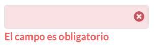
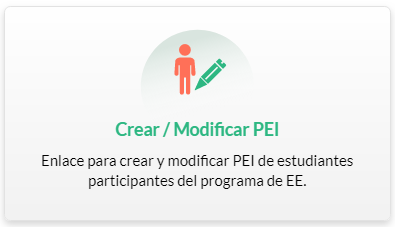
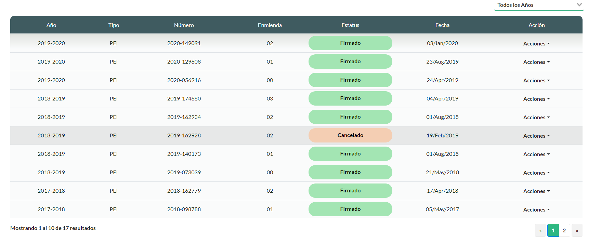

**Guide**
# Table of Contents
[[toc]]

# Components in Development

| Component     | Team          | Developer  | Date |
| ------------- |:-------------:| -----:| -----:|
| CustomDropDown  | Team 4 | Maria | 07/Jan./2020|
| SelectedEvaluation  | Team 3 | Guido | 06/Jan./2020|

# Component List 

## Custom Input

Input with Validations



**Use**: 
```HTML
<ValidationProvider :rules="required" immediate v-slot="{ errors, invalid }" name="">
<CustomInput
    v-model="model.Phone"
    :error="errors[0]"
    :invalid="invalid"
    v-bind.sync="invalid"
/>

</ValidationProvider>
```
::: tip
If want show message: "El campo Telefono adicional es obligatorio" use the property name of ValidationProvider
example: 
```HTML
<ValidationProvider :rules="required" immediate v-slot="{ errors, invalid }" name="Telefono Adicional"></ValidationProvider>
```
:::


## SquareOption




Use:

```HTML
<div v-for="(option, index) in optionList" v-bind:key="index" class="flip-card col-md-3">
    <squareOption :option="option"></squareOption>
</div>
```

``` JS
optionList: 
[
    {
        icon: "fas fa-user-edit",
        mainImage: "Icon_Crear_PEI.svg",
        hoverImage: "Icon_Crear_PEI_Hover.svg",
        title: "Crear / Modificar PEI",
        detail:
            "Enlace para crear y modificar PEI de estudiantes participantes del programa de EE. También se presenta un Historial de los PEI realizados del estudiante.",
        description: "Enlace para crear y modificar PEI de estudiantes participantes del programa de EE.",
        route: "/pei/history",
        needSelectedStudent: true
    }
]
```

## Vue Good Table


<b>Use: </b>
```HTML
<vue-good-table
    mode="remote"
    styleClass="table table-hover"
    :columns="tableConfig.columns"
    :rows="data"
    :totalRows="tableConfig.totalRecords"
    :pagination-options="{
        enabled: true
    }"
    :sort-options="{
        enabled: false
    }"
    @on-page-change="onPageChange"
    @on-sort-change="onSortChange"
    @on-column-filter="onColumnFilter"
    @on-per-page-change="onPerPageChange"
>
    <div slot="emptystate">
        No Existe informaciónn en sistema.
    </div>
    <template slot="table-row" slot-scope="props">
        <span v-if="props.column.label == 'Acción'">
           Acciones (Button, DropDown, etc..)
        </span>
        <span v-else-if="props.column.field == 'peiStatusDescription'">
            <span :class="'badge badges ' + getPeiStatusClass(props.formattedRow[props.column.field])">{{
                props.formattedRow[props.column.field]
            }}</span>
        </span>
        <span v-else>{{ props.formattedRow[props.column.field] }}</span>
    </template>
    <template slot="pagination-bottom" slot-scope="props">
        <customPager
            ref="historyPager"
            :perPage="tableConfig.serverParams.perPage"
            :total="props.total"
            :pageChanged="props.pageChanged"
            :perPageChanged="props.perPageChanged"
        ></customPager>
    </template>
</vue-good-table>
```

``` js
tableConfig: 
{
    totalRecords: 0,
    serverParams: {
        columnFilters: {},
        sort: {
            field: "",
            type: ""
        },
        page: 1,
        perPage: 10
    },
    columns: []
},
updateParams(newProps) {
    this.tableConfig.serverParams = Object.assign({}, this.tableConfig.serverParams, newProps);
},

onPageChange(params) {
    this.updateParams({ page: params.currentPage });
    this.getStudentPEI();
},

onPerPageChange(params) {
    this.updateParams({ perPage: params.currentPerPage });
    this.getStudentPEI();
},

onSortChange(params) {
    this.updateParams({
        sort: [
            {
                type: params.sortType,
                field: this.columns[params.columnIndex].field
            }
        ]
    });
    this.getStudentPEI();
},
onColumnFilter(params) {
    this.updateParams(params);
    this.getStudentPEI();
},
initColumns() {
    var tempColumns = [
        {
            label: "Año",
            field: "academicYear"
        },
        {
            label: "Tipo",
            field: "peiTypeDesc"
        },
        {
            label: "Número",
            field: "peiIdFormatted"
        },
        {
            label: "Enmienda",
            field: "generalRevisionNo"
        },
        {
            label: "Estatus",
            field: "peiStatusDescription",
            tdClass: "peiStatusCell"
        },
        {
            label: "Fecha",
            field: "generalClosedDate",
            type: "date",
            dateInputFormat: "yyyy-MM-dd",
            dateOutputFormat: "dd/MMM/yyyy"
        }
    ];
    if (this.showActionsColumn) {
        tempColumns.push({
            label: "Acción",
            field: "peiAcademicYear",
            tdClass: "peiActionCell"
        });
    }

    this.tableConfig.columns = tempColumns;
}

```

